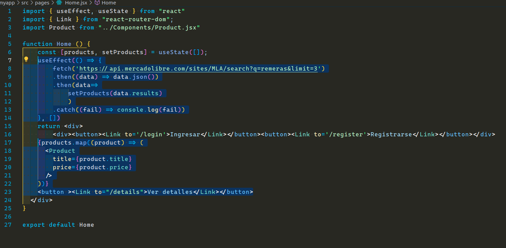
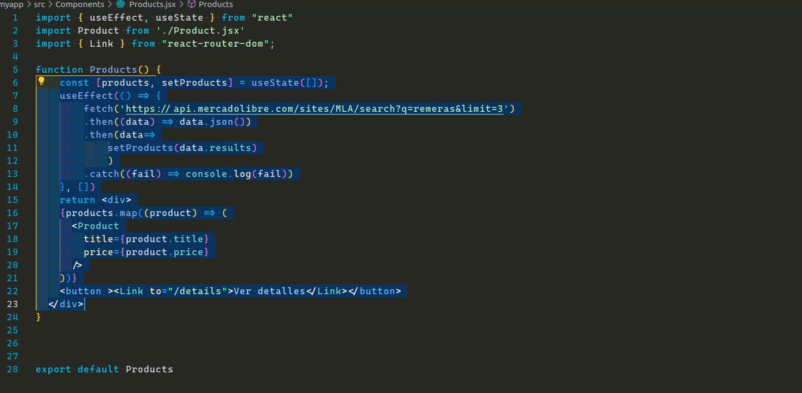

# Feedback

Hice algunos cambios en varios componentes comunes y de páginas. Primero te recomiendo mirar el componente "Details.jsx".

Componente Details:
Como puedes ver, el componente está todo comentada. En este componente el objetivo es buscar que sea el encargado de hacer la petición a la Api de MLA, pero sólo a un producto en particular. Esto significa que para hacer esta petición vamos a necesitar un `id` para saber que producto especificamente vamos a renderizar.
Al ser un sólo producto, nosotros no necesitamos mapear, simplemente mostrar la propiedades, o mejor dicho, la información que querramos mostrar. Así que en este caso, hice algunos cambios en el `JSX` para mostrar a modo de ejemplo, 3 propiedades, titulo, precio y garantía. Puedes agregar la propiedades que quieras, esto en sí es irrelevante, lo que nos importa es la navegación a "x" producto, pero si quieres conocer más puedes investigar como está compuesta esta petición a un producto. Te comparto el link para que lo veas en el navegador de uno de los productos que tienes en tu proyecto.
<https://api.mercadolibre.com/items/MLA1391454335>

Ahora que ya tenemos el componente de página "Details", el siguiente paso es incorporarlo en nuestro proyecto de forma eficiente. Pero antes de eso, debemos ver cómo está estructurada tu aplicación. Ire paso por paso y dejando tareas en cada componente:

App.jsx:
En este componente se encuentran tus rutas, sin embargo, no tenemos una ruta para poder hacer una navegación a un producto, es decir, sin una ruta que reciba un parámetro dinámico en el path no vamos a poder manejar la navegación. ////En clases se vio un ejemplo con un path similar al siguiente: "/detalle/:id". En este caso, `:id` es lo que representa tu ruta dinámica, es un nombre de parámetro que puedes utilizar
para acceder al valor específico en esa posición de la URL.///
En tu caso, el componente que vamos a renderizar cuando la URL coincida será el componente "Details.jsx" que ya hemos modificado.

En las rutas podemos notar que la ruta raíz es el componente de página "Home", pero quiero que notes algo que está pasando aquí (es importante que para ver las imágenes hayas abierto este archivo como "vista previa", la opción se encuentra con clic secundario sobre este archivo `FEEDBACK.md`):

Vamos a hacer comparación de dos de tus componentes, Home y Products:

Imagen de Home:

Imagen de Products:

Podemos notar que ambos componentes son muy similares y hacen petición a la misma URL. Para mantener tu código lo más semejante posible lo que haré será añadir un fragmento de react (`<></>`) en tu componente Home, y luego inyectar aquí el de Productos y hacer un poco de limpieza de código. Dejaré los botones que ya tienes de ingreso. Puedes ver el resultado como queda en el componente `Home.jsx`. Ahora sólo quedaría trabajar en el siguiente componente que es de "Products".

Products.jsx y Product.jsx:
En el componente `Products.jsx` ahora será el encargado de hacer la petición a la Api de MLA. Aquí inyectas el componente `Product.jsx`, que este último es la estructura de como se va a mostrar cada uno de tus productos. Por otro lado, además de la información que ya muestras, también deberías tener un botón para poder ver los detalles de determinado producto, para esto, debes mover el botón que ya tienes implementado en "Products" al componente "Product". Al hacer esto, cada producto va a tener el botón de "ver detalles". Al mover el botón al componente hijo "Product", debemos tener en cuenta que este va a requerir el `id` que nos llega en la petición de todos los productos, por ende, también lo vamos a pasar como "props" desde el componente `Products`, al igual que pasas las propiedades de title y price.
Ahora en el componente `Product` se debe desestructurar el id junto a las otras props y hacer algunos cambios en el botón.
La ruta del ya no va a ser "/details". Ahora tenemos que añadir el parámetro dinámico, pero aquí no nos debemos confundir, porque se requiere pasar la propiedad del id en sí y para esto debemos hacerlo con templay template string "${}". Ej:
"Link to={`/ruta-definida/${id}`}"

Con estos cambios, ya debería de funcionar la aplicación.

Lo que se hizo fue cuando se renderizan todos los productos, cada uno va a tener un botón de ver detalles, al hacer clic en uno de esto botones, estamos haciendo una navegación a una página para ver los detalles de un producto particular, el mismo dependerá del id que le esté llegando por el parámetro dinámico, que posteriormente, es capturado por el hook useParams() que provee react-router-dom.

Sé que puede ser un poco confuso, y hasta quizá te queme la cabeza con tantos comentarios, pero es muy normal al comienzo.
Si por alguna razón no logras hacerlo, no te preocupes, puedes hacer tu consulta sin miedo. Lo importante es que vos entiendas
paso por paso de todo lo que estamos haciendo al finalizar estas consignas

Saludos,
Enuel.
